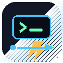

# RemoteForge VPS Delegator



RemoteForge VPS Delegator is a VS Code and Cursor extension for delegating local developer workflows to VPS targets. The current release is a foundation build: it includes the extension shell, commands, icon, tested core utilities, and the roadmap for the SSH-backed features.

Marketplace extension ID: `MichaelSam94.remoteforge-vps`

Marketplace display name: `RemoteForge VPS Delegator`

## Key Features

- Extension scaffold for VS Code 1.85+ and Cursor.
- Command Palette entries for RemoteForge configuration and refresh actions.
- Default keyboard shortcuts for the contributed commands.
- Tested core utilities for SSH command parsing, profile metadata handling, and log redaction.
- Marketplace-ready icon, README, changelog, and VSIX packaging workflow.
- Roadmap for SSH connection pooling, remote terminals, file sync, scripts, tunnels, and webview configuration.

## How To Install

1. Download the latest `.vsix` from the GitHub Releases page.
2. In VS Code or Cursor, open the Command Palette.
3. Run `Extensions: Install from VSIX...`.
4. Select the downloaded `remoteforge-vps-*.vsix` file.
5. Reload the editor if prompted.

You can also install from a terminal:

```bash
code --install-extension remoteforge-vps-0.0.6.vsix
```

For Cursor, use Cursor's equivalent command-line launcher if configured, or install the VSIX from the Extensions view.

## How To Use

### Open RemoteForge Configuration

Use this command to open the RemoteForge configuration entrypoint:

```text
RemoteForge: Open Configuration
```

Default shortcut:

```text
Windows/Linux: Ctrl+Alt+R
macOS: Cmd+Alt+R
```

In the current foundation release, this command shows a placeholder message. The planned configuration webview will let you add VPS profiles, choose authentication methods, test connections, and manage quick-run scripts.

### Refresh RemoteForge

Use this command to refresh the RemoteForge extension state:

```text
RemoteForge: Refresh Explorer
```

Default shortcut:

```text
Windows/Linux: Ctrl+Alt+Shift+R
macOS: Cmd+Alt+Shift+R
```

In the current foundation release, this command is registered for future explorer refresh behavior.

## Shortcuts

| Action | Command Palette command | Windows/Linux | macOS |
| --- | --- | --- | --- |
| Open configuration | `RemoteForge: Open Configuration` | `Ctrl+Alt+R` | `Cmd+Alt+R` |
| Refresh RemoteForge | `RemoteForge: Refresh Explorer` | `Ctrl+Alt+Shift+R` | `Cmd+Alt+Shift+R` |

To change shortcuts:

1. Open the Command Palette.
2. Run `Preferences: Open Keyboard Shortcuts`.
3. Search for `RemoteForge`.
4. Edit the keybinding for the command you want to customize.

## Current Status

This repository currently contains the foundation milestone:

- Strict TypeScript VS Code extension scaffold.
- Pure core modules for profile metadata, SSH command parsing, and secret-safe logging.
- Jest unit tests for the first core contracts.
- Roadmap and Superpowers implementation plan.
- Marketplace-ready icon and README.

SSH connection pool, webview configuration UI, explorer view, terminals, file sync, scripts, and tunnels are planned in `docs/ROADMAP.md`.

## Development

```bash
npm install
npm run lint
npm test -- --runInBand
npm run compile
npm run package
```

## Project Structure

```text
.
├── .github/workflows/        # GitHub Actions workflow for VSIX builds and releases
├── docs/                     # Roadmap and implementation planning docs
├── media/                    # Marketplace icon and source artwork
├── src/
│   ├── core/                 # Pure core logic with no VS Code imports
│   ├── shared/               # Shared logging utilities
│   ├── test/unit/            # Jest unit tests
│   └── extension.ts          # VS Code activation entrypoint
├── package.json              # VS Code extension manifest
└── README.md
```

## Security Direction

RemoteForge VPS Delegator is designed so profile secrets are stored through VS Code SecretStorage, never in workspace files or extension logs. The current core tests verify metadata/secret separation and log redaction.

## Roadmap

- Add the RemoteForge sidebar explorer.
- Add the configuration webview for VPS profiles and scripts.
- Implement SSH connection pooling with `ssh2`.
- Add remote terminals, quick-run scripts, file sync, and port tunnels.
- Add integration tests with `@vscode/test-electron`.

## License

MIT
